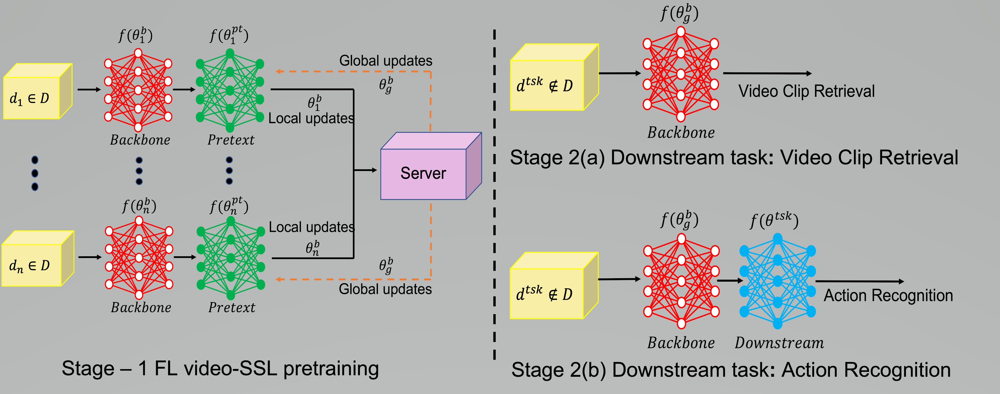
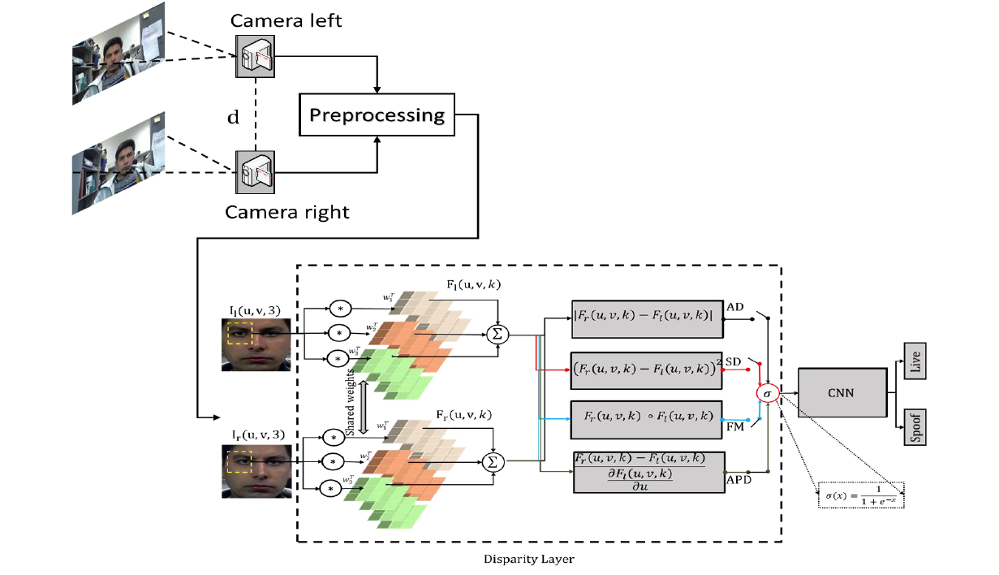
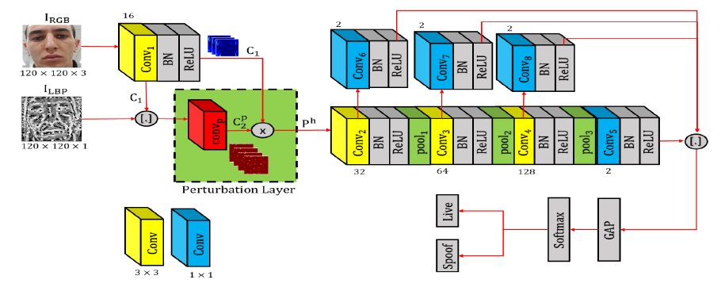
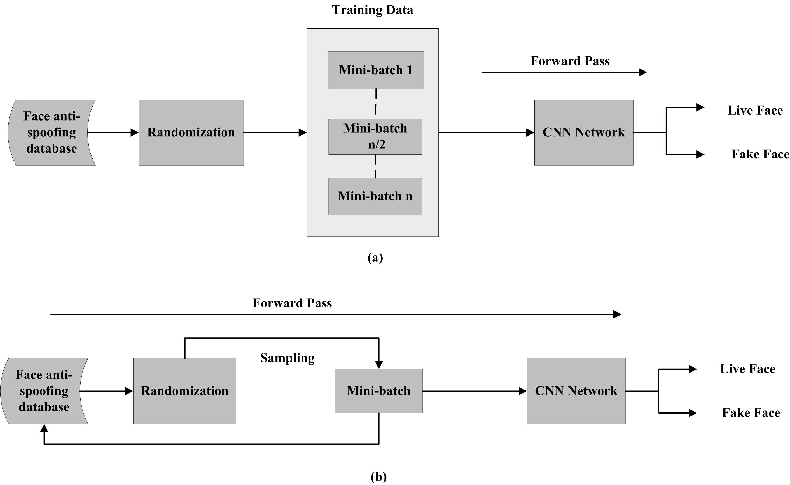
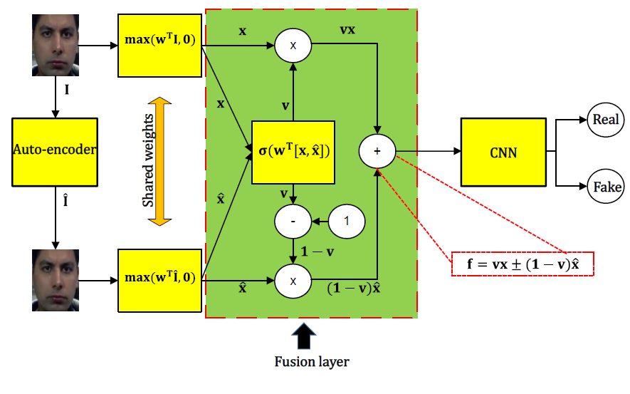
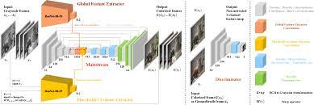

For a full list of publications, please refer to my [Google Scholar Profile](https://scholar.google.com/citations?hl=en&user=hDKFeWEAAAAJ).




  


**Selected Publications**
======

 

Federated Self-Supervised Learning for Video Understanding. 
**Yasar Abbas Ur Rehman**, Yan Gao, JiaJun Shen, Pedro Porto Buarque de Gusmao, Nicholas Lane  
**ECCV-2022**  
[[Preprint](https://arxiv.org/abs/2207.01975)] 
[[blog](https://flower.dev/blog/2023-04-05-federated-learning-with-self-supervision/)] 
[[Highlights](https://www.youtube.com/watch?v=ZLqst0lVte8&list=PLNG4feLHqCWni5zfOBaZNtaPlCce0OnJ6&index=8)] 
[[code](https://github.com/yasar-rehman/FEDVSSL)]
[[Supplementary](https://github.com/yasar-rehman/yasar/ECCV2022_SSL_FL_for_video_supplementry.pdf)] 
 

What Should Be Equivariant in Self-Supervised Learning?  
Yuyang Xie, Jianhong Wen, Kin Wai Lau, **Yasar Abbas Ur Rehman**, Jiajun Shen  
**CVPR-2022**  
[[Preprint](https://openaccess.thecvf.com/content/CVPR2022W/L3D-IVU/papers/Xie_What_Should_Be_Equivariant_in_Self-Supervised_Learning_CVPRW_2022_paper.pdf)]   

SLNet: Stereo face liveness detection via dynamic disparity-maps and convolutional neural network 
**Yasar Abbas Ur Rehman**, LM Po, M Liu  
**ESWA 2020**  
[[Paper](https://www.sciencedirect.com/science/article/abs/pii/S0957417419307195)] [[Code](https://github.com/yasar-rehman/SLNET)]
 

Enhancing deep discriminative feature maps via perturbation for face presentation attack detection. 
**Yasar Abbas Ur Rehman**, Lai-Man Po, Jukka Komulainen  
**IMVS-2020**  
[[Paper](https://www.sciencedirect.com/science/article/abs/pii/S0262885619304512)] [[Code](https://github.com/yasar-rehman/Perturbing-CNNs)]  
 

LiveNet: Improving features generalization for face liveness detection using convolution neural networks.  
**Yasar Abbas Ur Rehman**, Lai Man Po, Mengyang Liu  
**ESWA-2019** 
[[paper](https://www.sciencedirect.com/science/article/abs/pii/S0957417418302811)][[Code](https://github.com/yasar-rehman/LiveNet)] 
 

Face liveness detection using convolutional-features fusion of real and deep network generated face images. 
**Yasar Abbas Ur Rehman**, Lai-Man Po, Mengyang Liu, Zijie Zou, Weifeng Ou, Yuzhi Zhao  
**JVCI-2019**  
[[paper](https://www.sciencedirect.com/science/article/abs/pii/S1047320319300641)]  
 

VCGAN: video colorization with hybrid generative adversarial network. 
Yuzhi Zhao, Lai-Man Po, Wing-Yin Yu, **Yasar Abbas Ur Rehman**, Mengyang Liu, Yujia Zhang, Weifeng Ou  
**IEEE TMM-2021**  
[[preprint](https://arxiv.org/pdf/2104.12357)] [[Code](https://github.com/zhaoyuzhi/VCGAN)]  
 

SCGAN: saliency map-guided colorization with generative adversarial network.  
Yuzhi and Po, Lai-Man and Cheung, Kwok-Wai and Yu, Wing-Yin and **Yasar Abbas Ur Rehman**  
**IEEE TCSVT-2020**  
[[Preprint](https://arxiv.org/pdf/2011.11377.pdf), [Code]("https://github.com/zhaoyuzhi/Semantic-Colorization-GAN)]  
 

Fusion loss and inter-class data augmentation for deep finger vein feature learning.  
WF Ou, LM Po, C Zhou, **Yasar Abbas Ur Rehman**, PF Xian, YJ Zhang  
**ESWA-2021**  
[[Paper](https://www.sciencedirect.com/science/article/abs/pii/S0957417421000257)] [[Code](https://github.com/WeifengOu/FusionAug)]  

LinCos-softmax: Learning angle-discriminative face representations with linearity-enhanced cosine logits.  
Wei-Feng Ou, Lai-Man Po, Chang Zhou, Yu-Jia Zhang, Li-Tong Feng, **Yasar Abbas Ur Rehman**, Yu-Zhi Zhao 
**IEEE Access-2020**  
[[Paper](https://ieeexplore.ieee.org/stamp/stamp.jsp?arnumber=9116942)]

    

<!--
        

		<b> </b> 
		

		<b> Yasar Abbas Ur Rehman </b>, Po Lai Man  
        <a href="https://www.sciencedirect.com/science/article/abs/pii/S0957417418302811">[ESWA,2018]</a>
		<a href="https://github.com/yasar-rehman/LiveNet">[Code]</a>,
        <a href="">[ESWA, 2019]</a>
        <a href="">[Code]</a>, 
        <a href="https://www.sciencedirect.com/science/article/abs/pii/S1047320319300641">JVCI (2019)</a>, 
        <a href="">[IMVS(2020)]</a> 
        <a href="">[Code]</a>,
         
		

	

	

	

		
 
		 
		

	

	

		
 
		
 
		<b>A Novel Energy Efficient Object Detection and Image Transmission Approach in Wireless Multimedia Sensor Networks </b> 
		

		<b> Yasar Abbas Ur Rehman </b>, Muhammad Tariq, Takuro Sato  
		IEEE Sensor Journal, 2016  
		<a href="https://www.researchgate.net/publication/303770986_A_Novel_Energy_
			Efficient_Object_Detection_and_Image_Transmission_Approach_for_Wireless_Multimedia_Sensor_Networks"> [Preprint] </a>
		<a href="https://github.com/yasar-rehman/Energy-Efficient-Object-Detection-and-Image-Transmission-in-WMSN"> [Code] </a>
		

	

</body>
-->

